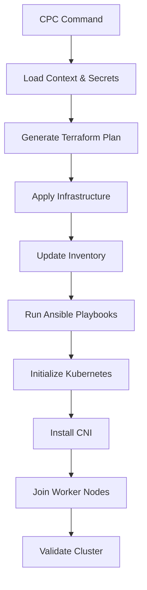

# Project Architecture Documentation

## Overview

The **my-kthw** (Kubernetes The Hard Way) project implements a comprehensive Infrastructure as Code (IaC) solution for deploying and managing Kubernetes clusters on Proxmox VE infrastructure. The architecture follows modern DevOps practices with clear separation of concerns between infrastructure provisioning, configuration management, and cluster orchestration.

## Workspace Support

The project supports multiple Linux distributions through a workspace-based architecture:

### ✅ Fully Supported Workspaces
- **Ubuntu 24.04** (`ubuntu`): Complete functionality with all features working
  - Kubernetes v1.31.x
  - Calico v3.28.0 CNI
  - MetalLB v0.14.8
  - All addons fully tested
  
- **SUSE** (`suse`): Complete functionality with all features working  
  - Kubernetes v1.30.x
  - Calico v3.27.0 CNI
  - MetalLB v0.14.5
  - All addons fully tested

### 🚧 Partial Support Workspaces
- **Debian** (`debian`): Basic functionality (some features in development)
- **Rocky Linux** (`rocky`): Basic functionality (some features in development)

Each workspace maintains its own:
- VM template configuration
- Kubernetes version specifications
- Addon version compatibility matrix
- Distribution-specific optimizations

## High-Level Architecture

```
┌─────────────────────────────────────────────────────────────────┐
│                    Development Workstation                      │
│  ┌─────────────┐ ┌─────────────┐ ┌─────────────┐ ┌─────────────┐│
│  │     CPC     │ │  OpenTofu   │ │   Ansible   │ │   kubectl   ││
│  │   Control   │ │Infrastructure│ │Configuration│ │  Cluster    ││
│  │   Script    │ │Provisioning │ │ Management  │ │ Management  ││
│  └─────────────┘ └─────────────┘ └─────────────┘ └─────────────┘│
└─────────────────────────────────────────────────────────────────┘
                                 │
                                 ▼
┌─────────────────────────────────────────────────────────────────┐
│                      Proxmox VE Cluster                        │
│  ┌─────────────────────────────────────────────────────────────┐│
│  │                    Virtual Machines                        ││
│  │  ┌─────────────────┐ ┌─────────────┐ ┌─────────────┐      ││
│  │  │ Control Plane   │ │  Worker 1   │ │  Worker 2   │      ││
│  │  │ cu1.bevz.net    │ │wu1.bevz.net │ │wu2.bevz.net │      ││
│  │  │ 10.10.10.116    │ │10.10.10.121 │ │10.10.10.120 │      ││
│  │  └─────────────────┘ └─────────────┘ └─────────────┘      ││
│  └─────────────────────────────────────────────────────────────┘│
└─────────────────────────────────────────────────────────────────┘
                                 │
                                 ▼
┌─────────────────────────────────────────────────────────────────┐
│                     Kubernetes Cluster                         │
│  ┌─────────────────────────────────────────────────────────────┐│
│  │  API Server │ etcd │ Controller │ Scheduler │ CNI (Calico)  ││
│  └─────────────────────────────────────────────────────────────┘│
│  ┌─────────────────────────────────────────────────────────────┐│
│  │              Container Workloads & Services                 ││
│  └─────────────────────────────────────────────────────────────┘│
└─────────────────────────────────────────────────────────────────┘
```

## Component Architecture

### 1. Control Layer (CPC Script)

The **Cluster Provisioning Control** (CPC) script serves as the unified interface for all cluster operations:

```bash
┌─────────────────────────────────────────────────────────────┐
│                        CPC Script                          │
├─────────────────────────────────────────────────────────────┤
│  Context Management    │  Infrastructure      │  Cluster   │
│  • Workspace Control  │  • VM Provisioning   │  • Node Mgmt│
│  • Environment Vars   │  • Template Creation  │  • K8s Ops │
│  • Secret Loading     │  • Network Config     │  • Addons  │
└─────────────────────────────────────────────────────────────┘
```

**Key Features:**
- **Multi-context support** (debian, ubuntu, rocky, suse)
- **Workspace isolation** per environment
- **Integrated secret management** with SOPS
- **Version-aware configurations** per OS distribution

### 2. Infrastructure Layer (Terraform/OpenTofu)

Infrastructure provisioning is handled through Infrastructure as Code principles:

```hcl
# File Structure
terraform/
├── main.tf              # Primary resource definitions
├── variables.tf         # Input parameters
├── outputs.tf           # Resource outputs (IPs, FQDNs)
├── locals.tf            # Node configuration mapping
├── providers.tf         # Proxmox provider configuration
├── backend.tf           # State management
├── environments/        # Per-context variable files
│   ├── ubuntu.tfvars
│   ├── debian.tfvars
│   └── rocky.tfvars
└── secrets.sops.yaml    # Encrypted credentials
```

**Resource Management:**
- **VM Templates**: Pre-configured with cloud-init
- **Network Configuration**: Static IP allocation
- **Storage Management**: System and container storage
- **Security Groups**: Firewall and access rules

### 3. Configuration Management Layer (Ansible)

Ansible handles system configuration and Kubernetes deployment:

```yaml
# Playbook Architecture
ansible/
├── ansible.cfg          # Ansible configuration
├── inventory/
│   └── tofu_inventory.py # Dynamic inventory from Terraform
├── playbooks/
│   ├── install_kubernetes_cluster.yml    # Component installation
│   ├── initialize_kubernetes_cluster.yml # Cluster bootstrap
│   └── validate_cluster.yml              # Post-deployment validation
└── roles/               # Reusable configuration modules
```

**Configuration Phases:**
1. **System Preparation**: OS updates, package installation
2. **Container Runtime**: containerd installation and configuration
3. **Kubernetes Components**: kubelet, kubeadm, kubectl installation
4. **Cluster Initialization**: Control plane and worker node setup
5. **Network Configuration**: CNI plugin installation (Calico)

### 4. Orchestration Layer (Kubernetes)

The Kubernetes cluster implements a standard control plane architecture:

```
Control Plane Node (cu1.bevz.net):
┌─────────────────────────────────────────────────────────┐
│  kube-apiserver  │  etcd  │  kube-controller-manager    │
│  kube-scheduler  │  kubelet  │  kube-proxy  │  calico   │
└─────────────────────────────────────────────────────────┘

Worker Nodes (wu1.bevz.net, wu2.bevz.net):
┌─────────────────────────────────────────────────────────┐
│  kubelet  │  kube-proxy  │  calico-node  │  containerd │
└─────────────────────────────────────────────────────────┘
```

## Network Architecture

### IP Address Allocation

```
Network Segmentation:
├── Node Network:      10.10.10.0/24
│   ├── Control Plane: 10.10.10.116
│   ├── Worker 1:      10.10.10.121
│   └── Worker 2:      10.10.10.120
├── Pod Network:       192.168.0.0/16
│   ├── Node 1 Pods:   192.168.189.0/24
│   ├── Node 2 Pods:   192.168.243.0/24
│   └── Node 3 Pods:   192.168.X.0/24
└── Service Network:   10.96.0.0/12
    ├── Kubernetes API: 10.96.0.1
    ├── CoreDNS:        10.96.0.10
    └── Services:       10.96.0.0/12
```

### Network Flow

```
External Traffic → LoadBalancer → Ingress → Service → Pod
     ↓
DNS Resolution: Pi-hole → Node IPs
     ↓
Pod-to-Pod: Calico CNI → BGP Routing → Direct Communication
     ↓
Service Discovery: CoreDNS → Service DNS → Pod IPs
```

## Data Flow Architecture

### 1. Deployment Flow



### 2. Configuration Flow


### 3. State Management

```
State Storage:
├── Terraform State
│   ├── Backend: S3/Local
│   ├── Workspaces: per-context isolation
│   └── Lock Management: concurrent access prevention
├── Ansible Facts
│   ├── Dynamic Inventory: Real-time VM discovery
│   ├── Host Variables: Node-specific configuration
│   └── Group Variables: Cluster-wide settings
└── Kubernetes State
    ├── etcd: Cluster state storage
    ├── ConfigMaps: Application configuration
    └── Secrets: Sensitive data management
```

## Security Architecture

### 1. Access Control

```
Authentication & Authorization:
├── Infrastructure Level
│   ├── Proxmox API: Username/Password authentication
│   ├── SSH Access: Key-based authentication only
│   └── SOPS: PGP/KMS encryption for secrets
├── Kubernetes Level
│   ├── API Server: Certificate-based authentication
│   ├── RBAC: Role-based access control
│   └── Service Accounts: Pod identity management
└── Network Level
    ├── Firewall Rules: Port and protocol restrictions
    ├── CNI Policies: Pod-to-pod communication control
    └── DNS Security: Hostname resolution control
```

### 2. Secret Management

```
Secret Lifecycle:
├── Creation: SOPS encryption with PGP/KMS
├── Storage: Encrypted files in version control
├── Distribution: Runtime decryption by authorized users
├── Usage: Environment variable injection
└── Rotation: Manual key rotation process
```

### 3. Network Security

```
Network Isolation:
├── VM Level: Proxmox firewall and network ACLs
├── Host Level: iptables and system firewalls  
├── Pod Level: Calico network policies
└── Service Level: Kubernetes network policies
```

## Scalability Architecture

### 1. Horizontal Scaling

```
Node Scaling:
├── Worker Nodes: Add via Terraform and join to cluster
├── Control Plane: Multi-master setup (future enhancement)
├── Storage: Distributed storage solutions (Longhorn/Rook)
└── Network: Calico scaling for larger pod networks
```

### 2. Resource Scaling

```
Resource Management:
├── CPU: Dynamic allocation per workload requirements
├── Memory: Configurable per node role and workload
├── Storage: Expandable volumes and storage classes
└── Network: Bandwidth management and QoS
```

### 3. Multi-Environment Support

```
Environment Isolation:
├── Development: Single-node or minimal cluster
├── Staging: Production-like multi-node setup
├── Production: High-availability with redundancy
└── Testing: Ephemeral clusters for CI/CD
```

## Monitoring and Observability

### 1. Infrastructure Monitoring

```
Infrastructure Metrics:
├── Proxmox: VM resource utilization and health
├── Node Level: CPU, memory, disk, network metrics
├── Container Runtime: containerd performance metrics
└── Network: Calico performance and connectivity
```

### 2. Application Monitoring

```
Kubernetes Metrics:
├── Cluster State: Node and pod health
├── Resource Usage: CPU, memory, storage consumption
├── Network Traffic: Inter-pod and service communication
└── Application Performance: Custom metrics collection
```

### 3. Logging Architecture

```
Log Aggregation:
├── System Logs: journald and syslog collection
├── Container Logs: kubectl logs aggregation
├── Application Logs: Structured logging best practices
└── Audit Logs: Kubernetes API audit trail
```

## Disaster Recovery Architecture

### 1. Backup Strategy

```
Backup Components:
├── Infrastructure: Terraform state and configurations
├── etcd: Kubernetes cluster state backups
├── Persistent Volumes: Application data backups
└── Configuration: Ansible playbooks and secrets
```

### 2. Recovery Procedures

```
Recovery Scenarios:
├── Node Failure: Automatic pod rescheduling
├── Control Plane Failure: etcd restore and rebuild
├── Complete Cluster Loss: Full rebuild from code
└── Data Loss: Volume snapshots and backup restore
```

## Performance Optimization

### 1. Resource Optimization

```
Performance Tuning:
├── CPU: Proper core allocation and affinity
├── Memory: Optimized JVM and container limits
├── Storage: SSD usage and I/O optimization
└── Network: Bandwidth allocation and QoS
```

### 2. Application Optimization

```
Workload Optimization:
├── Pod Scheduling: Node affinity and anti-affinity
├── Resource Requests: Proper CPU and memory sizing
├── Health Checks: Liveness and readiness probes
└── Autoscaling: HPA and VPA configuration
```

This architecture provides a robust, scalable, and maintainable foundation for Kubernetes cluster deployment and management on Proxmox infrastructure.
